# CDP Architecture — Mermaid Diagrams

> 13 individual diagrams, one per slide. Copy-paste into any Mermaid renderer.

---

## 1. Full Overview (Slide 3)

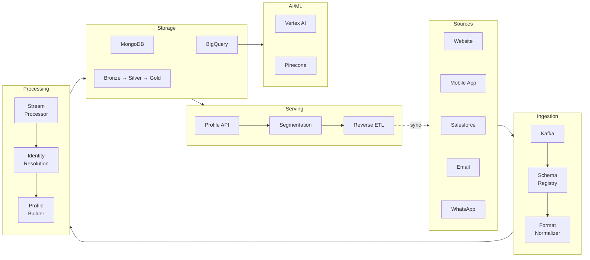

---

## 2. Data Sources (Slide 4)

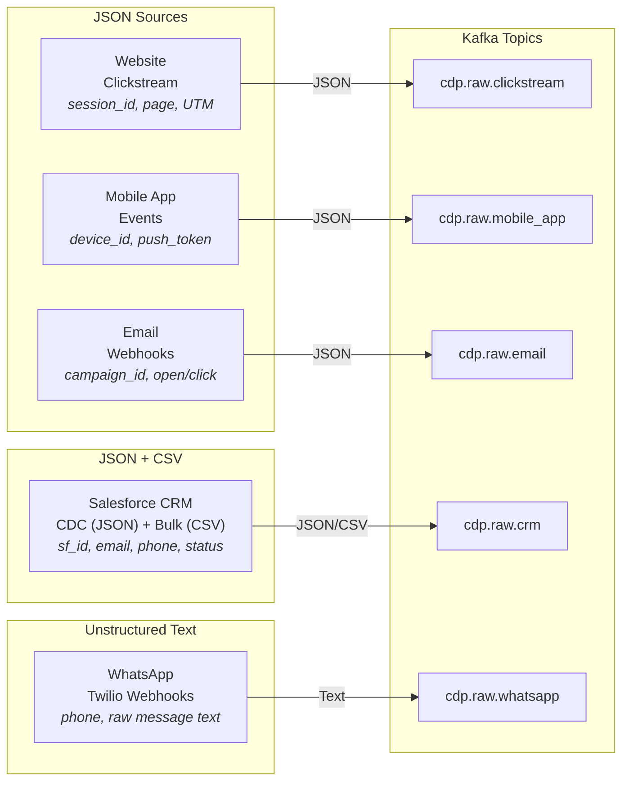

---

## 3. Ingestion Layer (Slide 5)

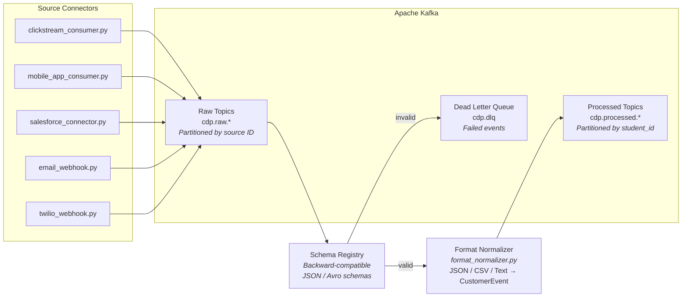

---

## 4. Processing Layer (Slide 6)

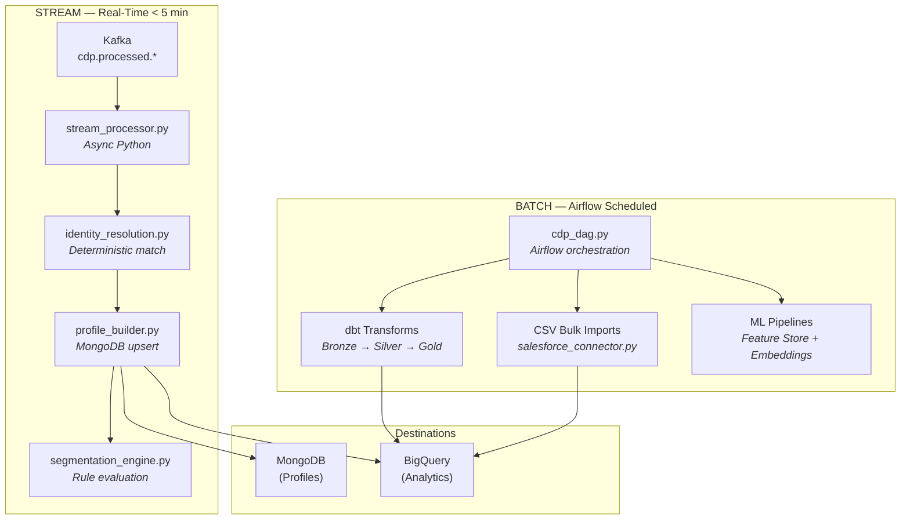

---

## 5. Identity Resolution (Slide 7)

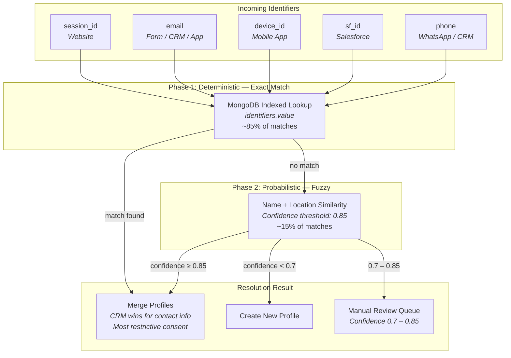

---

## 6. Storage Layer (Slide 8)

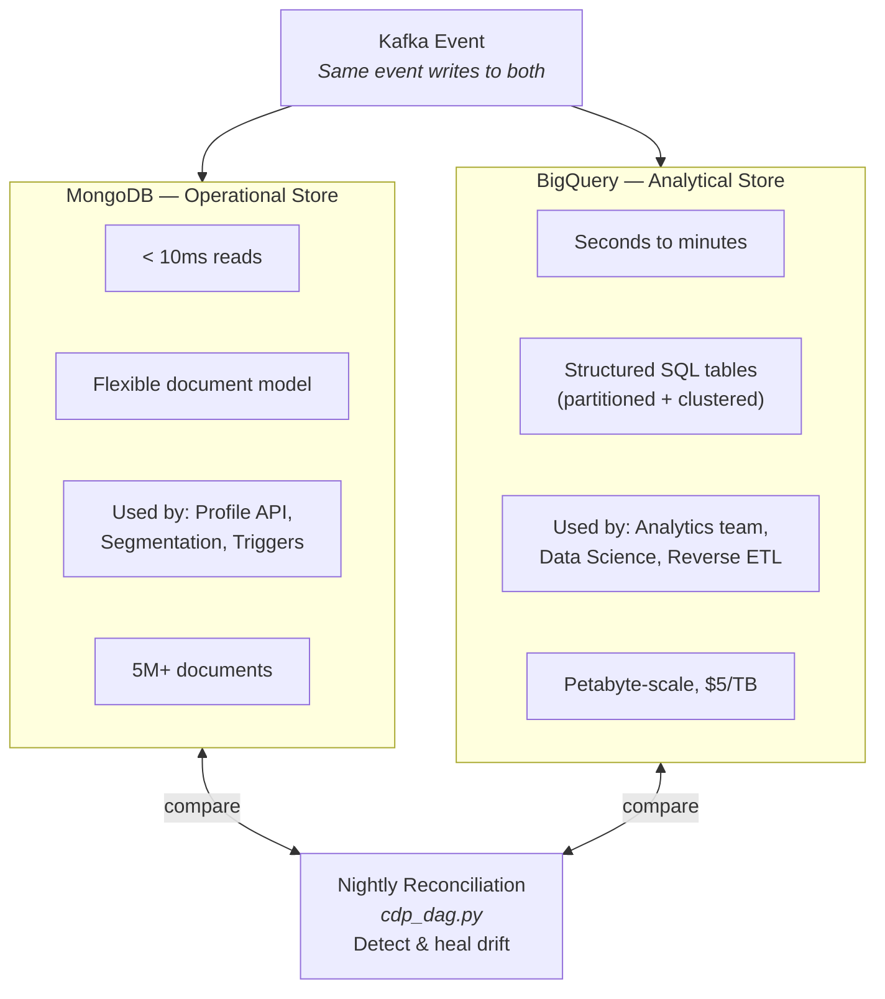

---

## 7. Medallion Architecture (Slide 9)

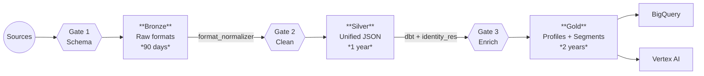

---

## 8. Reverse ETL (Slide 10)

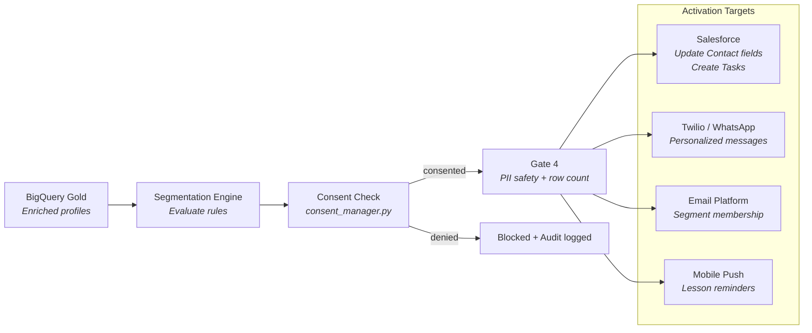

---

## 9. Segmentation & Triggers (Slide 11)

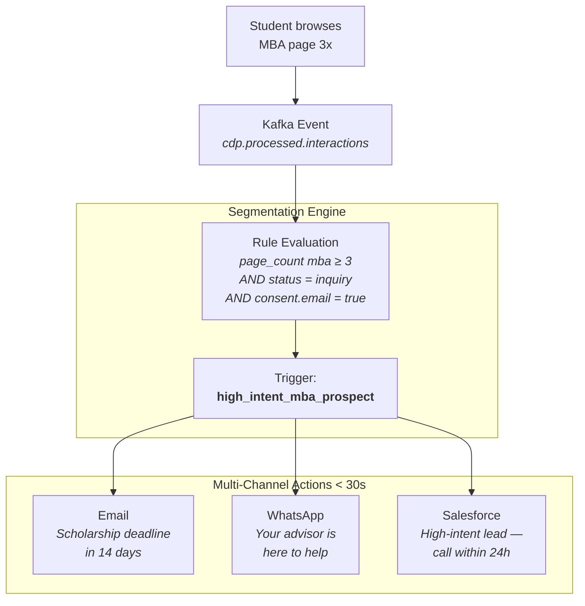

---

## 10. Data Quality — 4 Gates (Slide 12)

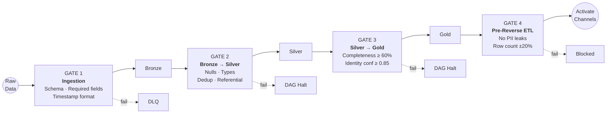

---

## 11. GDPR & Privacy (Slide 13)

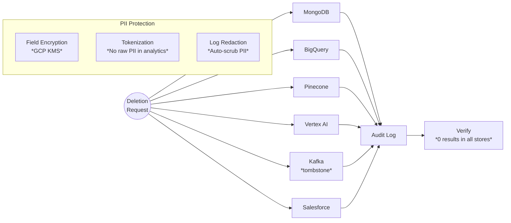

---

## 12. AI/ML Layer (Slide 14)

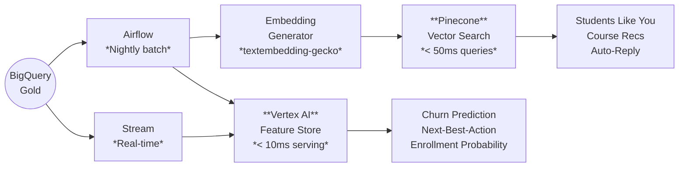

---

## 13. Observability (Slide 15)

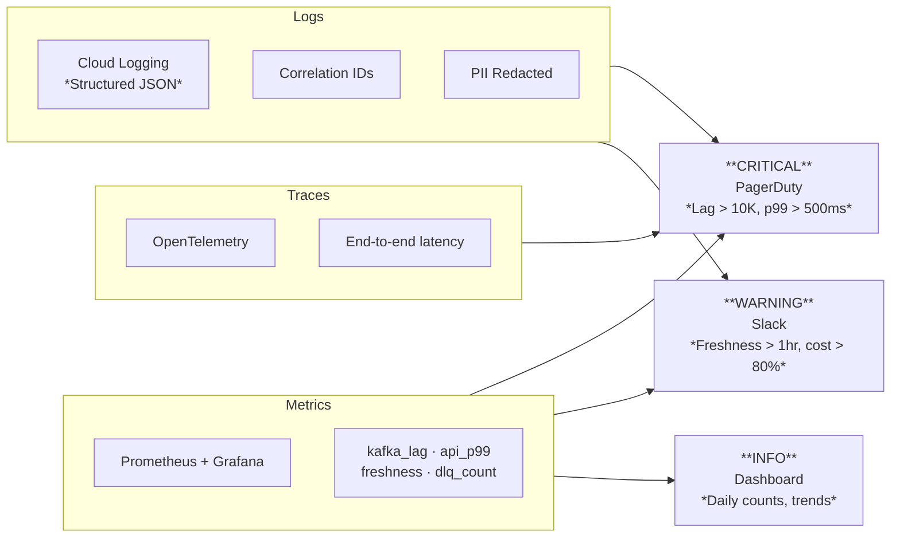
