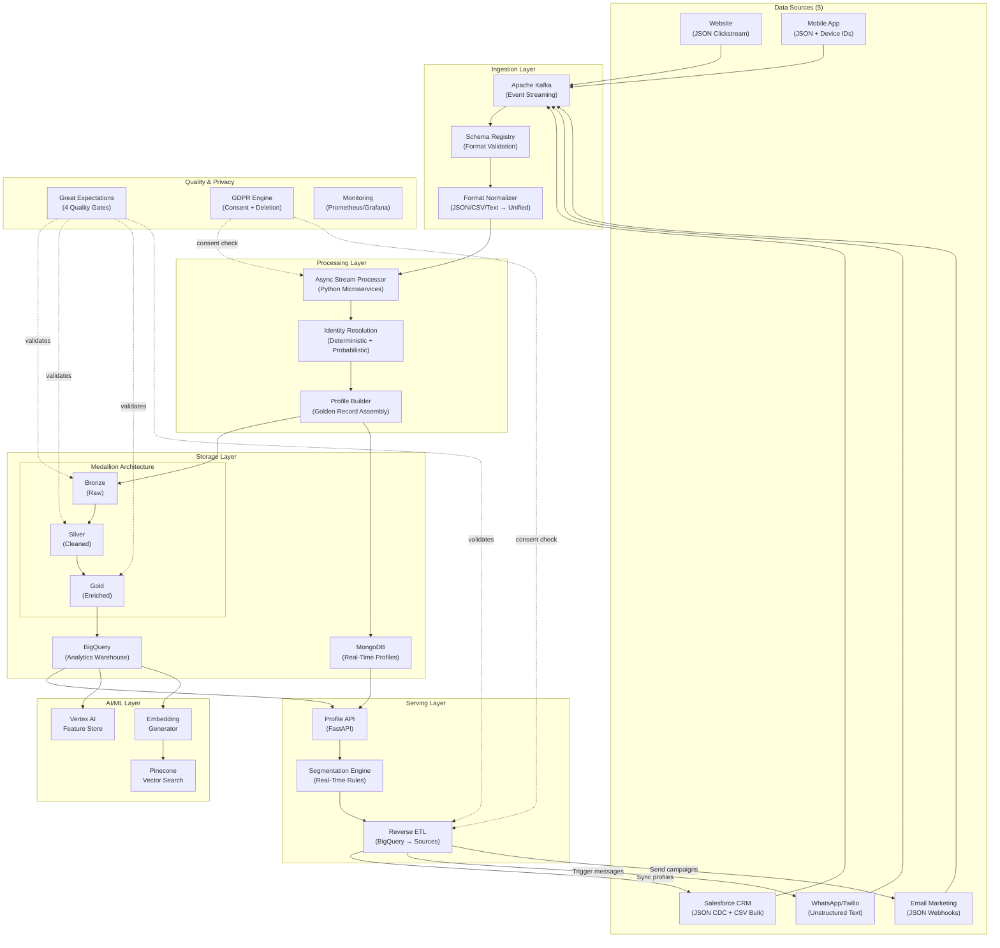

# Customer Data Platform (CDP) Architecture
## Consolidating Student Data for Real-Time Personalization & AI-Powered Engagement

---

## Slide 1: The Problem — Fragmented Student Data

### Today: 5 Data Silos, Zero Unified View

```
  ┌──────────┐  ┌──────────┐  ┌──────────┐  ┌──────────┐  ┌──────────┐
  │ Website  │  │ Mobile   │  │Salesforce│  │  Email   │  │ WhatsApp │
  │Clickstream│  │   App    │  │   CRM    │  │Marketing │  │ (Twilio) │
  │  (JSON)  │  │  (JSON)  │  │(JSON/CSV)│  │  (JSON)  │  │(Unstruct)│
  └────┬─────┘  └────┬─────┘  └────┬─────┘  └────┬─────┘  └────┬─────┘
       │              │             │              │              │
       ▼              ▼             ▼              ▼              ▼
    Isolated       Isolated      Isolated       Isolated       Isolated
    Analytics      Metrics       Records        Campaigns      Conversations
```

**Pain Points:**
- No single view of a student across their journey (Inquiry → Application → Enrollment → Active → Alumni)
- Marketing sends duplicate or conflicting messages across channels
- Analytics teams can't answer: "Which students are at risk of dropping out?"
- Data quality issues: different email formats, duplicate records, stale CRM data
- No real-time triggers: by the time we identify a high-intent prospect, the moment has passed
- GDPR compliance risk: PII scattered across systems with no centralized consent management

---

## Slide 2: Design Principles

### Architecture Philosophy

| Principle | What It Means | Why It Matters |
|-----------|--------------|----------------------|
| **Event-Driven** | Every student interaction is an event flowing through Kafka | Real-time reactions to behavioral signals (JD: "event-driven architectures") |
| **Near Real-Time** | Profile updates within 5 minutes of source event | Trigger enrollment nudges when intent is hot, not days later |
| **AI-Ready** | Data structured for ML consumption from day one | Vertex AI + Pinecone power churn prediction & course recommendations |
| **GDPR-Compliant** | Privacy as architecture, not afterthought | EU-based company — consent management, PII encryption, right-to-forget built in |
| **Format-Agnostic** | Handles JSON, CSV, unstructured text uniformly | WhatsApp text, Salesforce JSON, marketing CSV — all normalized to unified schema |
| **Incrementally Buildable** | MVP-first, add sources one by one | Solo engineer can deliver value in 8 weeks; full platform in 6 months |

---

## Slide 3: High-Level Architecture



---

## Slide 4: Data Sources — All 5 with Format Details

### Each Source: What Data, What Format, How Ingested

| Source | Format | Key Data Points | Connector | Kafka Topic |
|--------|--------|----------------|-----------|-------------|
| **Website** | JSON (clickstream) | Page views, course browsing, form submissions, session_id, UTM params | `clickstream_consumer.py` | `cdp.raw.clickstream` |
| **Mobile App** | JSON (events) | Lesson completions, quiz scores, app opens, device_id, push_token, offline study sessions | `mobile_app_consumer.py` | `cdp.raw.mobile_app` |
| **Salesforce CRM** | JSON (CDC) + CSV (bulk) | Contact records, advisor notes, enrollment status, application stage, phone, email | `salesforce_connector.py` | `cdp.raw.crm` |
| **Email Marketing** | JSON (webhooks) | Opens, clicks, bounces, unsubscribes, campaign_id, template_id | `email_webhook.py` | `cdp.raw.email` |
| **WhatsApp (Twilio)** | Unstructured text | Raw messages, timestamps, phone numbers, media attachments | `twilio_webhook.py` | `cdp.raw.whatsapp` |

### Format Challenge: How We Normalize

```
WhatsApp: "Hi, when is the deadline for MBA?" → NLP → {intent: "enrollment_inquiry", entity: "MBA", sentiment: 0.6}
JSON:     {event: "page_view", page: "/mba"} → Schema validate → Normalize timestamps + field names
CSV:      name,email,phone,status\n"Max","max@gmail.com"... → Polars parse → Type inference → Validate
```

**Key Decision:** All formats pass through `format_normalizer.py` — a single module that converts everything to a unified Pydantic `CustomerEvent` model. Downstream consumers never deal with format differences.

---

## Slide 5: Ingestion Layer — Kafka + Schema Registry

### Event Streaming Architecture

```
Sources ──→ Connectors ──→ Schema Registry ──→ Kafka Topics ──→ Consumers
                              (validate)         (partitioned)

Topic Naming:  cdp.raw.{source}        → Bronze (raw events)
               cdp.processed.{type}     → Silver (normalized events)
               cdp.dlq                  → Dead Letter Queue (failed events)
```

### Kafka Configuration

| Setting | Value | Rationale |
|---------|-------|-----------|
| **Partitions** | Keyed by `student_id` (or `session_id` for anonymous) | Ensures all events for one student go to same partition → ordered processing |
| **Replication Factor** | 3 | Fault tolerance — survive broker failure |
| **Retention** | 7 days (raw topics), 30 days (processed topics) | Balance between replay capability and cost |
| **Serialization** | JSON with Schema Registry (Avro for high-throughput sources) | Schema evolution support, backward compatibility |
| **Delivery Guarantee** | At-least-once + idempotent consumers | No data loss; consumers deduplicate using event_id |

### Dead Letter Queue (DLQ)

Events that fail validation at Gate 1 → `cdp.dlq` topic → alerting → manual investigation dashboard.
**Trade-off:** We prefer at-least-once over exactly-once for simplicity. Deduplication happens at the consumer level using `event_id` as idempotency key.

---

## Slide 6: Processing — Async Python Microservices

### Stream + Batch Processing

```
┌─────────────────────────────────────────────────┐
│  STREAM PROCESSING (Real-Time)                    │
│  Kafka Consumer → Async Python (FastAPI workers)  │
│                                                   │
│  • Format normalization (JSON/Text/CSV→unified)   │
│  • Schema validation (Pydantic models)            │
│  • Identity resolution (deterministic matching)   │
│  • Profile update (MongoDB upsert)                │
│  • Segmentation evaluation (rule matching)        │
│  • Trigger firing (Kafka → Reverse ETL)           │
│                                                   │
│  Latency: < 5 minutes end-to-end                  │
└─────────────────────────────────────────────────┘

┌─────────────────────────────────────────────────┐
│  BATCH PROCESSING (Scheduled)                     │
│  Airflow DAGs → Spark/Polars jobs                 │
│                                                   │
│  • CSV bulk imports (Salesforce exports)           │
│  • BigQuery Bronze → Silver → Gold transforms     │
│  • Identity resolution (probabilistic matching)   │
│  • Feature computation (Vertex AI Feature Store)  │
│  • Embedding generation (Vertex AI → Pinecone)    │
│  • Data quality checkpoints (Great Expectations)  │
│                                                   │
│  Frequency: Hourly for transforms, nightly for ML │
└─────────────────────────────────────────────────┘
```

**Why Async Python (not Java/Scala Flink)?**
- The role requires Python + async microservices
- FastAPI + asyncio handles 10K+ events/sec per worker
- Same language as data science team → easier collaboration
- Docker containers scale horizontally via Cloud Run auto-scaling

**Trade-off:** Python stream processing is simpler but less performant than Flink at extreme scale. For this volume (millions of profiles, not billions), Python is sufficient and reduces operational complexity.

---

## Slide 7: Identity Resolution

### The Core Problem: One Student, Five Identities

```
Website:    session_id="abc", fingerprint="fp_123"       ← anonymous
Form:       session_id="abc", email="max@gmail.com"       ← now identified
Mobile:     device_id="dev_456", email="max@gmail.com"    ← cross-device
Salesforce: sf_id="003xxx", email="max@gmail.com", phone="+49123456"
WhatsApp:   phone="+49123456", message="When is the MBA deadline?"
```

### Two-Phase Matching

```
Phase 1: DETERMINISTIC (exact match on known identifiers)
  email → email match:  Website ↔ Mobile ↔ Salesforce     ✅ High confidence
  phone → phone match:  Salesforce ↔ WhatsApp              ✅ High confidence
  session_id → session: Anonymous web ↔ Form submission     ✅ Same session

Phase 2: PROBABILISTIC (fuzzy match when deterministic fails)
  name + location similarity > 0.85 threshold              ⚠️ Manual review flag
  Used when: different emails but same phone, or same name but different device
```

### Golden Record Rules

| Field | Source of Truth | Fallback |
|-------|----------------|----------|
| Name, Phone, Email | Salesforce (CRM) | Most recently updated source |
| Enrollment Status | Salesforce | — |
| Behavior (pages, clicks) | Website + Mobile App | — |
| Engagement Score | Calculated (across all sources) | — |
| Consent | Most restrictive across merged profiles | — |

**Trade-off:** Deterministic matching is fast and accurate but misses some connections. Probabilistic matching catches more but risks false merges. We default to conservative (separate profiles) and surface low-confidence matches for human review.

---

## Slide 8: Storage — MongoDB + BigQuery

### Dual-Store Strategy: Speed + Analytics

```
┌─────────────────────────────────┐    ┌─────────────────────────────────┐
│  MongoDB (Operational Store)     │    │  BigQuery (Analytical Store)     │
│                                  │    │                                  │
│  Purpose: Real-time profile      │    │  Purpose: Complex analytics,     │
│           retrieval              │    │           reporting, ML training  │
│                                  │    │                                  │
│  Latency: < 10ms reads          │    │  Latency: Seconds to minutes     │
│                                  │    │                                  │
│  Schema: Flexible document       │    │  Schema: Structured tables       │
│          (nested profile JSON)   │    │          (partitioned + clustered)│
│                                  │    │                                  │
│  Use by: Profile API,            │    │  Use by: Analytics team,         │
│          Segmentation Engine,    │    │          Data Scientists,        │
│          Marketing Triggers      │    │          Reverse ETL,            │
│                                  │    │          BigQuery ML             │
│                                  │    │                                  │
│  Scale: 5M+ documents            │    │  Scale: Petabyte-scale           │
│         ~50ms p99 writes         │    │         ~$5/TB scanned           │
└─────────────────────────────────┘    └─────────────────────────────────┘
```

**Why both? (Not redundant)**
- MongoDB serves the **hot path**: profile lookups during student interactions (API, segmentation, triggers). Needs < 10ms latency.
- BigQuery serves the **analytical path**: "Show me all students who browsed MBA pages in the last 30 days and haven't applied." Needs SQL + aggregations across millions of rows.
- They serve different access patterns. Trying to use one for both would compromise either speed or query flexibility.

**Trade-off:** Maintaining two stores adds complexity (eventual consistency between them). Mitigated by: event-driven updates (same Kafka event writes to both), reconciliation jobs (nightly BigQuery→MongoDB diff check).

---

## Slide 9: Medallion Architecture — Bronze / Silver / Gold

### Three Layers: Raw → Cleaned → Enriched

```
┌─────────────────────────────────────────────────────────────────────┐
│                                                                     │
│  BRONZE (Raw)                     SILVER (Cleaned)                  │
│  ┌──────────────────┐             ┌──────────────────┐             │
│  │ Original format  │  Format-    │ Unified JSON     │  Enrichment │
│  │ preserved        │  specific   │ schema           │  + Identity │
│  │                  │──parsers──→│                  │──Resolution──│
│  │ WhatsApp: raw    │             │ Deduped          │             │
│  │ JSON: raw payload│             │ Null-handled     │             │
│  │ CSV: raw rows    │             │ Type-cast        │             │
│  └──────────────────┘             └──────────────────┘             │
│                                                                     │
│                          GOLD (Enriched)                            │
│                          ┌──────────────────┐                      │
│                     ──→  │ Unified profiles  │                      │
│                          │ Aggregated metrics│                      │
│                          │ Segment membership│                      │
│                          │ ML features       │                      │
│                          └──────────────────┘                      │
│                                                                     │
└─────────────────────────────────────────────────────────────────────┘

Storage:  BigQuery (all 3 layers) + GCS (Bronze raw files)
Tooling:  dbt for SQL transforms (Silver→Gold), Python for Bronze→Silver
Quality:  Great Expectations gate between each layer
```

**Why three layers (not two)?**
- **Bronze** preserves raw data for audit, compliance, and reprocessing. If identity resolution logic changes, we can reprocess from Bronze without re-ingesting from sources.
- **Silver** is the "single source of truth" for clean, normalized data. All format-specific parsing is done here.
- **Gold** is business-ready: pre-aggregated metrics, segment memberships, ML features. Analysts query Gold directly.

---

## Slide 10: Reverse ETL — BigQuery → Marketing Systems

### Closing the Loop: Insights → Action

```
BigQuery Gold ──→ Reverse ETL Engine ──→ Marketing Systems
                    │
                    ├──→ Salesforce: Update Contact fields, create Tasks
                    │     (enrollment_score, segment, last_interaction)
                    │
                    ├──→ Twilio/WhatsApp: Trigger personalized messages
                    │     (re-engagement, deadline reminders)
                    │
                    ├──→ Email Platform (Braze/SendGrid): Update segments
                    │     (add/remove from campaign audiences)
                    │
                    └──→ Mobile Push: Trigger notifications
                          (lesson reminders, course recommendations)
```

### How It Works
1. Segmentation engine evaluates rules against Gold profiles
2. Students entering/leaving segments → Kafka event `cdp.segment.change`
3. Reverse ETL consumer picks up segment changes
4. **Consent check:** Before pushing to ANY channel, verify consent in consent store
5. Push updates to target system via API (Salesforce REST, Twilio API, Braze API)
6. **Gate 4 quality check:** Validate before push (no PII in wrong fields, row count sanity)

**Trade-off:** We push incrementally (only changed segments) not full dumps. This reduces API calls (Salesforce has rate limits: 100K calls/day) but means we need to track segment membership state.

---

## Slide 11: Real-Time Segmentation & Marketing Triggers

### Event-Driven Personalization

```
Student browses MBA page 3x ──→ Kafka event ──→ Segmentation Engine
                                                        │
                                                        ▼
                                              Rule: page_count("mba") >= 3
                                                    AND enrollment_status = "inquiry"
                                                    AND consent.email = true
                                                        │
                                                        ▼
                                              Trigger: "high_intent_mba_prospect"
                                                        │
                                              ┌─────────┼──────────┐
                                              ▼         ▼          ▼
                                          Email     WhatsApp    Salesforce
                                        "Scholarship  "Your      "High-intent
                                        deadline in   advisor    lead — call
                                        14 days"      here to    within 24h"
                                                      help"
```

### Segment Types

| Type | Evaluation | Example |
|------|-----------|---------|
| **Real-time** | On every event | "Browsed MBA 3x this week" → immediate trigger |
| **Batch** | Nightly recalculation | "Active students with declining engagement" → daily report |
| **ML-driven** | Model prediction | "Churn risk > 0.75" → Vertex AI Feature Store query |

---

## Slide 12: Data Quality — 4 Gates with Great Expectations

### Quality is Not Optional: Gates at Every Layer Transition

```
Gate 1 (Ingestion)     Gate 2 (Bronze→Silver)    Gate 3 (Silver→Gold)    Gate 4 (Pre-Reverse ETL)
┌────────────────┐     ┌────────────────────┐     ┌──────────────────┐    ┌─────────────────────┐
│Schema conformance│    │No nulls in required │    │Profile complete-  │   │No PII in wrong      │
│Required fields   │    │Types correct        │    │  ness ≥ 60%      │   │  fields              │
│Timestamp format  │    │Referential integrity│    │Identity confidence│   │Row count ±20%        │
│→ DLQ on failure  │    │Dedup check          │    │  ≥ 0.85          │   │Salesforce field      │
└────────────────┘     └────────────────────┘     │No orphan records  │   │  mapping valid       │
                                                   └──────────────────┘    └─────────────────────┘
```

**Why Great Expectations (not dbt tests)?**
- Works across ALL stores: Kafka streams, MongoDB, BigQuery, CSV files
- dbt tests only work with SQL warehouses — can't validate streaming data or MongoDB
- GE integrates natively with Airflow (GE checkpoint = Airflow task)
- Custom Python expectations for domain-specific checks (PII detection, cross-source agreement)

**On failure:** Gate 1 → DLQ; Gates 2-3 → Airflow DAG fails + alert; Gate 4 → Reverse ETL blocked (stale but safe)

---

## Slide 13: GDPR & Privacy — Consent Management

### Privacy as Architecture (EU Company = Non-Negotiable)

```
┌───────────────────────────────────────────────────────────────┐
│  CONSENT STORE (MongoDB)                                       │
│                                                                 │
│  {                                                              │
│    student_id: "prof_001",                                      │
│    channels: {                                                  │
│      email: {consented: true, timestamp: "2026-01-15", v: 2}, │
│      whatsapp: {consented: false, timestamp: "2026-02-01"},    │
│      push: {consented: true, timestamp: "2026-01-15"},         │
│      analytics: {consented: true, legal_basis: "legitimate_interest"} │
│    }                                                            │
│  }                                                              │
└───────────────────────────────────────────────────────────────┘
```

### Right-to-Forget: Cascade Deletion Across All Stores

```
Student requests deletion → gdpr_deletion.py orchestrates:
  1. MongoDB:       DELETE profile document
  2. BigQuery:      DELETE FROM * WHERE student_id = X (row-level)
  3. Pinecone:      DELETE vector by metadata (student_id = X)
  4. Vertex AI:     DELETE feature entity
  5. Kafka:         Publish tombstone record
  6. Salesforce:    DELETE Contact via Reverse ETL
  7. Audit log:     Record: who, when, what was deleted

SLA: Complete within 72 hours (GDPR allows 30 days)
Verification: Automated sweep — query all stores, confirm zero results
```

### PII Protection
- **Field-level encryption:** Email, phone, name encrypted with GCP KMS (envelope encryption)
- **Tokenization:** Analytics queries use hashed `profile_id`, never raw PII
- **Log redaction:** PII auto-redacted in all structured logs (`student_id: "[REDACTED]"`)

---

## Slide 14: AI/ML Data Serving — Vertex AI + Pinecone

### Two Systems, Two Purposes

```
┌──────────────────────────────┐     ┌──────────────────────────────┐
│  Vertex AI Feature Store      │     │  Pinecone Vector Database     │
│                                │     │                                │
│  Structured features for ML:   │     │  Embeddings for similarity:    │
│  • days_since_last_login       │     │  • Student behavior vectors    │
│  • assignment_completion_30d   │     │  • Course content vectors      │
│  • email_engagement_score      │     │  • WhatsApp message vectors    │
│  • enrollment_funnel_stage     │     │                                │
│                                │     │  Use cases:                    │
│  Serves:                       │     │  • "Students like you"         │
│  • Churn prediction model      │     │  • Course recommendations      │
│  • Next-best-action model      │     │  • Similar inquiry auto-reply  │
│  • Enrollment probability      │     │                                │
│                                │     │  Latency: < 50ms               │
│  Latency: < 10ms (online)     │     │  Scale: 5M+ vectors            │
└──────────────────────────────┘     └──────────────────────────────┘

Data Flow:
  BigQuery Gold → Airflow DAG → Vertex AI Feature Store (nightly batch)
  BigQuery Gold → Vertex AI Embeddings API → Pinecone (nightly upsert)
  Kafka → Vertex AI Feature Store (real-time streaming features)
```

**Why Vertex AI Feature Store (not Feast)?** Native GCP integration with BigQuery, managed infrastructure, supports both batch and streaming ingestion.

**Why Pinecone (not pgvector)?** Fully managed, sub-50ms at millions of vectors, no ops overhead. Pinecone scales without tuning — pgvector requires manual index management.

---

## Slide 15: Observability — Logging, Metrics, Alerting

### Three Pillars of Observability

| Pillar | Tool | Key Signals |
|--------|------|-------------|
| **Logging** | Google Cloud Logging (structured JSON) | Correlation IDs, PII redaction, pipeline stage tracking |
| **Metrics** | Prometheus + Grafana | Kafka lag, API latency p99, BQ cost, identity match rate, DLQ count |
| **Tracing** | OpenTelemetry + Cloud Trace | End-to-end latency per event (source → profile update → trigger) |

### Alert Tiers

| Tier | Channel | Examples |
|------|---------|---------|
| **CRITICAL** (page on-call) | PagerDuty | Kafka lag > 10K msgs, pipeline down > 5min, DLQ spike > 1%, API p99 > 500ms |
| **WARNING** (notify team) | Slack | Data freshness > 1hr, BQ cost > 80% budget, GE check failed, consent sync lag > 30min |
| **INFO** (dashboard only) | Grafana | Daily profile count, source ingestion rates, identity match rate trend |

---

## Slide 16: Deployment — Docker + CI/CD + Pipeline CLI

### Infrastructure Stack

```
┌──────────────────────────────────────────────────────────────┐
│  LOCAL DEV           STAGING              PRODUCTION          │
│  Docker Compose      GCP Cloud Run        GCP Cloud Run       │
│  Kafka + MongoDB +   + Kafka + MongoDB    + Kafka + MongoDB   │
│  BQ Emulator         Atlas + BigQuery     Atlas + BigQuery    │
│                                                                │
│  CI/CD: GitHub Actions                                         │
│  ┌─ Lint (ruff) ─ Type check (mypy) ─ Unit tests (pytest)    │
│  ├─ Integration tests (Docker) ─ GE quality tests             │
│  └─ Security scan (bandit) ─ Secrets detection                │
│                                                                │
│  Git: Trunk-based, Conventional Commits, squash merge         │
│  Pre-commit: ruff + mypy + detect-secrets + fast tests        │
└──────────────────────────────────────────────────────────────┘
```

### Pipeline CLI: Onboard New Sources Fast

```bash
$ python -m cdp_cli generate-connector --name "new_lms" --type streaming --format json
# Creates: connector, schema, quality checks, unit test, updates Airflow DAG
```

---

## Slide 17: EdTech Use Cases

### Use Case 1: Enrollment Re-engagement
**Trigger:** Student browsed MBA page 3x + downloaded brochure + hasn't applied
**Action:** Personalized email + WhatsApp advisor message + Salesforce task
**Impact:** 2-3x higher conversion vs. generic nurture campaigns

### Use Case 2: Churn Prevention
**Trigger:** Vertex AI predicts churn_risk > 0.75 (declining app usage + negative WhatsApp sentiment)
**Action:** Push notification + advisor WhatsApp + Salesforce "At Risk" flag
**Impact:** Early intervention → improved retention rate

### Use Case 3: Course Recommendation
**Trigger:** Student completes 80% of a course
**Action:** Pinecone similarity search → "Students like you loved: [3 courses]"
**Impact:** Increased cross-enrollment + student satisfaction

### Use Case 4: GDPR Deletion
**Trigger:** Student submits deletion request
**Action:** Automated cascade across all 6 stores within 72 hours
**Impact:** Full compliance, zero manual intervention

---

## Slide 18: Identity Resolution Walkthrough

### Step-by-Step: One Student, Five Sources

```
Step 1: Anonymous web visit → Profile: {anon_001, session: "abc"}
Step 2: Form submission (email revealed) → Merge: {prof_001, email + session}
Step 3: Mobile app login (same email) → Link: {prof_001, + device_id}
Step 4: Salesforce advisor call (adds phone) → Link: {prof_001, + phone + sf_id}
Step 5: WhatsApp message (from phone) → Link: {prof_001, + whatsapp}

Result: Single profile "prof_001" with 5 linked identifiers,
        unified history from ALL 5 sources,
        segment: "high_intent_mba_prospect"
```

### Conflict Resolution
- **CRM (Salesforce)** is source-of-truth for contact info (name, email, phone)
- **Website/App** is source-of-truth for behavioral data
- **Consent** follows the **most restrictive** rule across merged profiles
- **Low-confidence matches** (probabilistic, < 0.85) → held for manual review

---

## Slide 19: SLAs + Cost Analysis

### Performance Guarantees

| SLA | Target |
|-----|--------|
| Profile API latency | p99 < 200ms |
| Streaming data freshness | < 5 minutes |
| Batch data freshness | < 4 hours |
| Identity match rate | > 85% |
| Segmentation trigger | < 30 seconds |
| GDPR deletion | < 72 hours |
| System uptime | 99.9% |

### Cost: Custom CDP vs. Commercial

| | Custom CDP (this architecture) | Segment | mParticle |
|---|---|---|---|
| **Monthly cost (5M profiles)** | ~$3,000 | ~$12,000 | ~$10,000 |
| **Customization** | Full control | Limited | Limited |
| **Identity resolution** | Custom rules | Predefined | Predefined |
| **AI/ML integration** | Native (Vertex AI + Pinecone) | Third-party | Third-party |
| **GDPR control** | Full (we own the data) | Vendor-dependent | Vendor-dependent |

**Break-even: ~6 months** (engineering cost amortized against commercial CDP savings)

---

## Slide 20: Production Timeline

### MVP-First: Ship Value Early, Scale Incrementally

| Scenario | Timeline | First Value |
|----------|----------|-------------|
| **Solo Engineer** | 6 months | Week 8: Salesforce → unified profile → BigQuery |
| **Small Team (2-3)** | 4 months | Week 5: First 2 sources integrated |
| **Full Team (4+)** | 3 months | Week 4: All sources in parallel |

### Solo Engineer Phased Approach
```
Weeks 1-4:   Foundation + Salesforce connector (highest value)
Weeks 4-8:   Core pipeline + identity resolution (deterministic)
Weeks 8-12:  Website + WhatsApp connectors
Weeks 12-16: Profile API + Segmentation + Reverse ETL
Weeks 16-20: Email + Mobile + Monitoring
Weeks 20-24: AI/ML (Vertex AI + Pinecone) + Hardening
```

**Key Principle:** Ship value every 4 weeks. The CLI pipeline generator ensures consistency as new sources are added.

---

## Slide 21: Summary — Why This Architecture

### Key Differentiators

| What | Why It Matters |
|------|---------------|
| **Event-driven + real-time** | React to student behavior in seconds, not days |
| **All 5 sources, all formats** | JSON, CSV, unstructured text — unified through one normalizer |
| **Identity resolution** | One student, one profile, across all channels |
| **GDPR-native** | Consent management + right-to-forget built into the architecture |
| **AI-ready** | Vertex AI Feature Store + Pinecone enable personalization at scale |
| **Reverse ETL** | Insights flow back to Salesforce, Twilio, Email — closed feedback loop |
| **Production-realistic** | Docker, CI/CD, monitoring, quality gates, Git workflow |
| **Incrementally buildable** | MVP in 8 weeks solo; full platform in 3-6 months |

### Technology Stack Summary

| Layer | Technology |
|-------|-----------|
| Streaming | Apache Kafka + Schema Registry |
| Profile Store | MongoDB Atlas |
| Analytics | Google BigQuery |
| API Layer | FastAPI (async Python) |
| Orchestration | Apache Airflow |
| AI/ML | Vertex AI Feature Store + Pinecone |
| Data Quality | Great Expectations |
| Privacy | Custom GDPR engine + GCP KMS |
| Monitoring | Prometheus + Grafana + PagerDuty |
| Infrastructure | Docker + GitHub Actions CI/CD + GCP Cloud Run |
| Language | Python (typed, async, Pydantic models) |

---

*Architecture designed for an EdTech Customer Data Platform*
*Supporting code and documentation: [GitHub Repository]*
